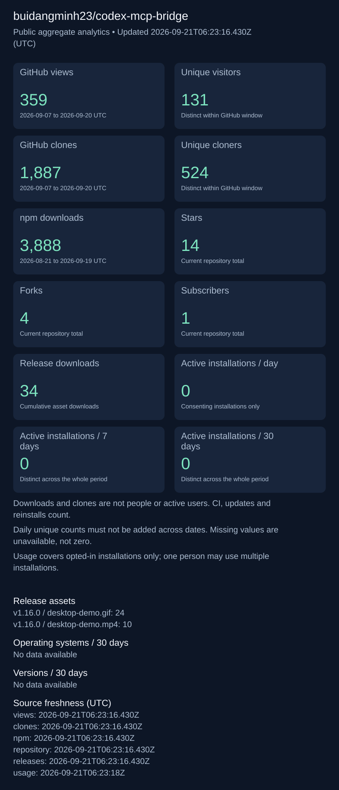

# Public repository analytics

[Live dashboard · refreshes every 30 seconds](https://buidangminh23.github.io/codex-mcp-bridge/)

[Aggregate JSON history](data.json) · [Repository](https://github.com/buidangminh23/codex-mcp-bridge)

All dates and source windows use UTC. Source timestamps on the dashboard show when each metric was last available. Downloads and clones include automation and do not measure people. Unique visitors/cloners apply only to the source window; never sum daily unique counts across dates. Active installations cover consenting installations only, with distinct counts for each whole period. Operating system and version breakdowns cover 30 days; an installation may appear in multiple version groups after upgrading.

This branch contains only aggregate statistics. No installation identifiers, prompts, account details, credentials, private error messages, or local paths are published. Missing metrics mean unavailable, not zero.

## Daily history

Every archived source day is listed below, newest first. Active installations count consenting installations that reported that UTC day.

| Date (UTC) | Views | Unique visitors | Clones | Unique cloners | npm downloads | Active installations |
|---|---:|---:|---:|---:|---:|---:|
| 2026-09-23 | 13 | 7 | 74 | 35 | Unavailable | Unavailable |
| 2026-09-22 | 13 | 7 | 61 | 30 | Unavailable | Unavailable |
| 2026-09-21 | 12 | 6 | 117 | 48 | 89 | Unavailable |
| 2026-09-20 | 11 | 7 | 53 | 32 | 17 | Unavailable |
| 2026-09-19 | 8 | 3 | 149 | 56 | 22 | Unavailable |
| 2026-09-18 | 11 | 10 | 72 | 45 | 44 | Unavailable |
| 2026-09-17 | 19 | 8 | 126 | 51 | 0 | Unavailable |
| 2026-09-16 | 47 | 22 | 182 | 53 | 61 | Unavailable |
| 2026-09-15 | 75 | 16 | 661 | 127 | 0 | Unavailable |
| 2026-09-14 | 53 | 17 | 205 | 55 | 493 | Unavailable |
| 2026-09-13 | 16 | 11 | 20 | 19 | 29 | Unavailable |
| 2026-09-12 | 12 | 9 | 13 | 13 | 47 | Unavailable |
| 2026-09-11 | 9 | 6 | 18 | 16 | 45 | Unavailable |
| 2026-09-10 | 30 | 19 | 30 | 24 | 26 | Unavailable |
| 2026-09-09 | 28 | 15 | 110 | 51 | 40 | Unavailable |
| 2026-09-08 | 19 | 6 | 72 | 34 | 0 | Unavailable |
| 2026-09-07 | 21 | 10 | 176 | 56 | 0 | Unavailable |
| 2026-09-06 | 40 | 11 | 357 | 78 | 978 | Unavailable |
| 2026-09-05 | 35 | 15 | 243 | 55 | 1,361 | Unavailable |
| 2026-09-04 | 20 | 6 | 44 | 15 | 167 | Unavailable |
| 2026-09-03 | 12 | 5 | 35 | 14 | 0 | Unavailable |
| 2026-09-02 | 11 | 5 | 6 | 6 | 0 | Unavailable |
| 2026-09-01 | 5 | 3 | 7 | 7 | 9 | Unavailable |
| 2026-08-31 | 6 | 5 | 7 | 6 | 9 | Unavailable |
| 2026-08-30 | Unavailable | Unavailable | Unavailable | Unavailable | 14 | Unavailable |
| 2026-08-29 | Unavailable | Unavailable | Unavailable | Unavailable | 20 | Unavailable |
| 2026-08-28 | Unavailable | Unavailable | Unavailable | Unavailable | 145 | Unavailable |
| 2026-08-27 | Unavailable | Unavailable | Unavailable | Unavailable | 12 | Unavailable |
| 2026-08-26 | Unavailable | Unavailable | Unavailable | Unavailable | 11 | Unavailable |
| 2026-08-25 | Unavailable | Unavailable | Unavailable | Unavailable | 18 | Unavailable |
| 2026-08-24 | Unavailable | Unavailable | Unavailable | Unavailable | 23 | Unavailable |
| 2026-08-23 | Unavailable | Unavailable | Unavailable | Unavailable | 280 | Unavailable |
| 2026-08-22 | Unavailable | Unavailable | Unavailable | Unavailable | 9 | Unavailable |
| 2026-08-21 | Unavailable | Unavailable | Unavailable | Unavailable | 25 | Unavailable |
| 2026-08-20 | Unavailable | Unavailable | Unavailable | Unavailable | 238 | Unavailable |
| 2026-08-19 | Unavailable | Unavailable | Unavailable | Unavailable | 0 | Unavailable |
| 2026-08-18 | Unavailable | Unavailable | Unavailable | Unavailable | 0 | Unavailable |
| 2026-08-17 | Unavailable | Unavailable | Unavailable | Unavailable | 0 | Unavailable |
| 2026-08-16 | Unavailable | Unavailable | Unavailable | Unavailable | 0 | Unavailable |
| 2026-08-15 | Unavailable | Unavailable | Unavailable | Unavailable | 0 | Unavailable |
| 2026-08-14 | Unavailable | Unavailable | Unavailable | Unavailable | 0 | Unavailable |
| 2026-08-13 | Unavailable | Unavailable | Unavailable | Unavailable | 0 | Unavailable |
